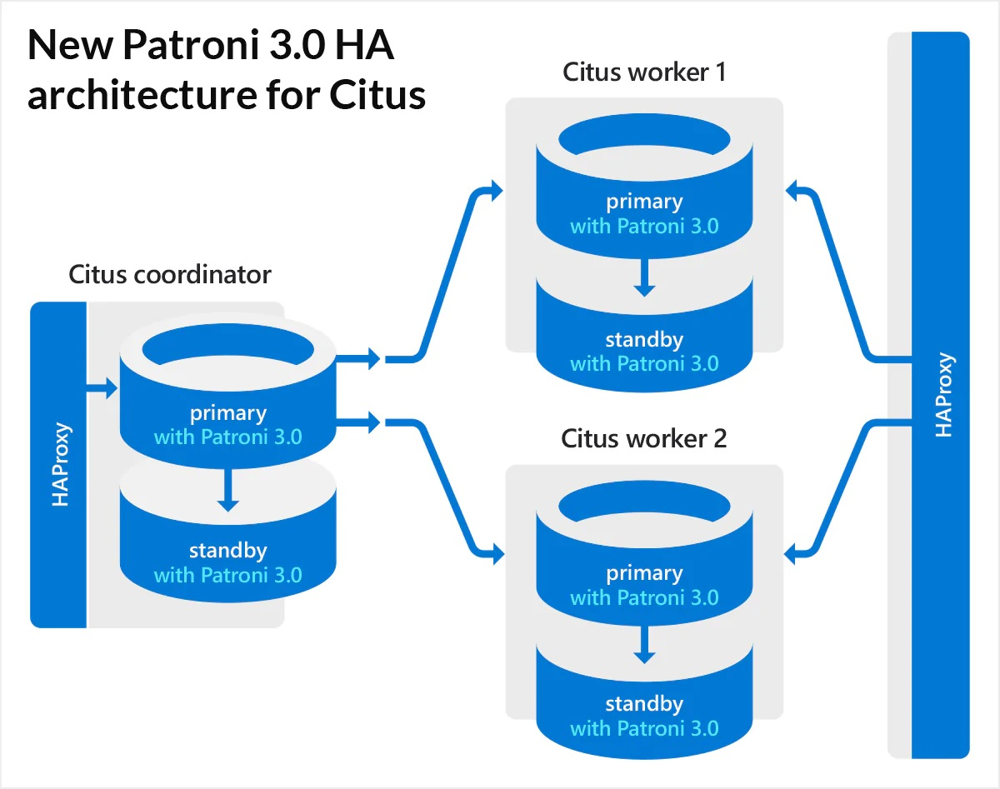
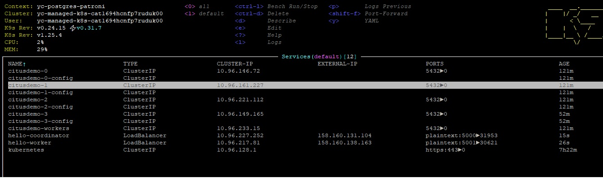

# Деплой HA кластера на базе Postgresql+Patroni+Citus  в Kubernetes (Yandex Cloud). 

За основу проекта была взята статья https://habr.com/ru/companies/otus/articles/755032/  
Наша цель кластер представленный на рисунке   
Поднимаем инфраструктуру в YC c помощью terraform состоящую кластера Kubernetes (3 ноды имеющие каждая 16Gb memory, 4 CPU).

```
cd terraform_k8s;
terraform apply;
```
Подключаемся к кластеру
```
 yc managed-kubernetes cluster  get-credentials $(yc managed-kubernetes cluster list | sed '4!d' | awk '{print $2}')   --external --force
```
Развернем кластер Patroni+Citus, используя репозиторий 
```
git clone git@github.com:zalando/patroni.git
cd HW12/patroni/kuberbetes
```
Собираем docker-образ patromi+citus
```
docker build -f Dockerfile.citus -t mzabolotnov/patroni-citus-k8s:v1.0 .
```
и делам push в репозиторий для последующего использования в Yandex Cloud
```
docker push mzabolotnov/patroni-citus-k8s:v1.0
``` 
берем файлик citus_k8s.yaml и меняем наименование образа в нескольких местах на свой, только что собранный
```- name: *cluster_name
     image: mzabolotnov/patroni-citus-k8s:v1.0 
```
деплоим
```
kubectl apply -f citus_k8s.yaml
```
в итоге получаем
```
kubectl get pods -l cluster-name=citusdemo -L role
NAME            READY   STATUS    RESTARTS   AGE   ROLE
citusdemo-0-0   1/1     Running   0          44s   master
citusdemo-0-1   1/1     Running   0          40s   replica
citusdemo-0-2   1/1     Running   0          34s   replica
citusdemo-1-0   1/1     Running   0          44s   master
citusdemo-1-1   1/1     Running   0          40s   replica
citusdemo-2-0   1/1     Running   0          43s   master
citusdemo-2-1   1/1     Running   0          39s   replica

```
Заходим в контейнер citusdemo-0-0 и смотрим конфигурацию кластера patroni. Видим что конфигурация представляет собой как бы три кластера, у каждого свой мастер. Как мы в дальнейшем увидим группа citusdemo-0 - это координатор citus, а citusdemo-1 и citusdemo-2 два воркера.
```
kubectl exec -ti citusdemo-0-0 -- bash
postgres@citusdemo-0-0:~$ patronictl list
+ Citus cluster: citusdemo -------------+--------------+-----------+----+-----------+
| Group | Member        | Host          | Role         | State     | TL | Lag in MB |
+-------+---------------+---------------+--------------+-----------+----+-----------+
|     0 | citusdemo-0-0 | 10.112.130.9  | Leader       | running   |  1 |           |
|     0 | citusdemo-0-1 | 10.112.128.10 | Sync Standby | streaming |  1 |         0 |
|     0 | citusdemo-0-2 | 10.112.129.10 | Replica      | streaming |  1 |         0 |
|     1 | citusdemo-1-0 | 10.112.128.9  | Leader       | running   |  1 |           |
|     1 | citusdemo-1-1 | 10.112.130.10 | Sync Standby | streaming |  1 |         0 |
|     2 | citusdemo-2-0 | 10.112.129.9  | Leader       | running   |  1 |           |
|     2 | citusdemo-2-1 | 10.112.130.11 | Sync Standby | streaming |  1 |         0 |
+-------+---------------+---------------+--------------+-----------+----+-----------+
```
заходим в БД citus и создаем таблицу
```
postgres@citusdemo-0-0:~$ psql citus
psql (15.5 (Debian 15.5-1.pgdg120+1))
Type "help" for help.

citus=# CREATE TABLE public.uk_price (
     transaction_unique_identifier UUID PRIMARY KEY,
     price character varying(50),
     date_of_transfer timestamp without time zone,
     postcode character varying(10),
     property_type character varying(10),
     "Old/New" character varying(10),
     duration character varying(10),
     paon character varying(100),
     saon character varying(50),
     street character varying(100),
     locality character varying(50),
     "Town/City" character varying(50),
     district character varying(50),
     county character varying(50),
     ppdcategory_type character varying(10),
     record_status character varying(10)
);
CREATE TABLE
```
загружаем данные и делаем запрос
```
citus=# \timing
Timing is on.
citus=# \COPY uk_price from '202304.csv' with CSV DELIMITER ','
COPY 28276228
Time: 3589372.241 ms (59:49.372)
citus=# select count(*) from  uk_price where property_type='S';
  count
---------
 7736105
(1 row)

Time: 2397.317 ms (00:02.397)
```
Время исполнения запроса 02.397с. Это для нераспределенной таблицы.  
Создаем распределенную таблицу
```
citus=# SELECT create_distributed_table('public.uk_price', 'transaction_unique_identifier');
NOTICE:  Copying data from local table...
NOTICE:  copying the data has completed
DETAIL:  The local data in the table is no longer visible, but is still on disk.
HINT:  To remove the local data, run: SELECT truncate_local_data_after_distributing_table($$public.uk_price$$)
 create_distributed_table
--------------------------

(1 row)
```
Выполняем, следуя подсказке. Я так понял, если эту команду по удалению локальных данных не выполнить, то первый Select на данной таблице будет выполняться достаточно долго. 
```
citus=# SELECT truncate_local_data_after_distributing_table($$public.uk_price$$)
 truncate_local_data_after_distributing_table
----------------------------------------------

(1 row)

Time: 373.264 ms
```
Смотрим, как наши данные распределились по воркерам
```
citus=# SELECT * from citus_shards;
 table_name | shardid |   shard_name    | citus_table_type | colocation_id |   nodename   | nodeport | shard_size
------------+---------+-----------------+------------------+---------------+--------------+----------+------------
 uk_price   |  102008 | uk_price_102008 | distributed      |             1 | 10.112.128.9 |     5432 |  166068224
 uk_price   |  102009 | uk_price_102009 | distributed      |             1 | 10.112.129.9 |     5432 |  166100992
 uk_price   |  102010 | uk_price_102010 | distributed      |             1 | 10.112.128.9 |     5432 |  166289408
 uk_price   |  102011 | uk_price_102011 | distributed      |             1 | 10.112.129.9 |     5432 |  166117376
 uk_price   |  102012 | uk_price_102012 | distributed      |             1 | 10.112.128.9 |     5432 |  165658624
 uk_price   |  102013 | uk_price_102013 | distributed      |             1 | 10.112.129.9 |     5432 |  166076416
 uk_price   |  102014 | uk_price_102014 | distributed      |             1 | 10.112.128.9 |     5432 |  166838272
 uk_price   |  102015 | uk_price_102015 | distributed      |             1 | 10.112.129.9 |     5432 |  166182912
 uk_price   |  102016 | uk_price_102016 | distributed      |             1 | 10.112.128.9 |     5432 |  165724160
 uk_price   |  102017 | uk_price_102017 | distributed      |             1 | 10.112.129.9 |     5432 |  165421056
 uk_price   |  102018 | uk_price_102018 | distributed      |             1 | 10.112.128.9 |     5432 |  166051840
 uk_price   |  102019 | uk_price_102019 | distributed      |             1 | 10.112.129.9 |     5432 |  164667392
 uk_price   |  102020 | uk_price_102020 | distributed      |             1 | 10.112.128.9 |     5432 |  166084608
 uk_price   |  102021 | uk_price_102021 | distributed      |             1 | 10.112.129.9 |     5432 |  166043648
 uk_price   |  102022 | uk_price_102022 | distributed      |             1 | 10.112.128.9 |     5432 |  166035456
 uk_price   |  102023 | uk_price_102023 | distributed      |             1 | 10.112.129.9 |     5432 |  166567936
 uk_price   |  102024 | uk_price_102024 | distributed      |             1 | 10.112.128.9 |     5432 |  165953536
 uk_price   |  102025 | uk_price_102025 | distributed      |             1 | 10.112.129.9 |     5432 |  165715968
 uk_price   |  102026 | uk_price_102026 | distributed      |             1 | 10.112.128.9 |     5432 |  165502976
 uk_price   |  102027 | uk_price_102027 | distributed      |             1 | 10.112.129.9 |     5432 |  166158336
 uk_price   |  102028 | uk_price_102028 | distributed      |             1 | 10.112.128.9 |     5432 |  166723584
 uk_price   |  102029 | uk_price_102029 | distributed      |             1 | 10.112.129.9 |     5432 |  165584896
 uk_price   |  102030 | uk_price_102030 | distributed      |             1 | 10.112.128.9 |     5432 |  165675008
 uk_price   |  102031 | uk_price_102031 | distributed      |             1 | 10.112.129.9 |     5432 |  166060032
 uk_price   |  102032 | uk_price_102032 | distributed      |             1 | 10.112.128.9 |     5432 |  166060032
 uk_price   |  102033 | uk_price_102033 | distributed      |             1 | 10.112.129.9 |     5432 |  165756928
 uk_price   |  102034 | uk_price_102034 | distributed      |             1 | 10.112.128.9 |     5432 |  166182912
 uk_price   |  102035 | uk_price_102035 | distributed      |             1 | 10.112.129.9 |     5432 |  165208064
 uk_price   |  102036 | uk_price_102036 | distributed      |             1 | 10.112.128.9 |     5432 |  165830656
 uk_price   |  102037 | uk_price_102037 | distributed      |             1 | 10.112.129.9 |     5432 |  165888000
 uk_price   |  102038 | uk_price_102038 | distributed      |             1 | 10.112.128.9 |     5432 |  166682624
 uk_price   |  102039 | uk_price_102039 | distributed      |             1 | 10.112.129.9 |     5432 |  166518784
(32 rows)

Time: 31.644 ms
```
делаем аналитический запрос
```
citus=# select count(*) from  uk_price where property_type='S';
  count
---------
 7736105
(1 row)

Time: 1525.364 ms (00:01.525)
```
Время исполнения запроса 1.525с
Теперь запускаем еще один кластер воркер citusdemo-3. Раскоментируем соответствующие строки в файле citus_k8s.yaml
После применения изменений в итоге получаем.
```
kubectl get pods -l cluster-name=citusdemo -L role
NAME            READY   STATUS    RESTARTS   AGE   ROLE
citusdemo-0-0   1/1     Running   0          70m   master
citusdemo-0-1   1/1     Running   0          70m   replica
citusdemo-0-2   1/1     Running   0          70m   replica
citusdemo-1-0   1/1     Running   0          70m   master
citusdemo-1-1   1/1     Running   0          70m   replica
citusdemo-2-0   1/1     Running   0          70m   master
citusdemo-2-1   1/1     Running   0          70m   replica
citusdemo-3-0   1/1     Running   0          79s   master
citusdemo-3-1   1/1     Running   0          75s   replica
```
делаем ребалансинг таблицы, чтобы распределить ее по трем воркерам
```
citus=# SELECT rebalance_table_shards('uk_price');
NOTICE:  Moving shard 102014 from 10.112.128.9:5432 to 10.112.129.11:5432 ...
NOTICE:  Moving shard 102023 from 10.112.129.9:5432 to 10.112.129.11:5432 ...
NOTICE:  Moving shard 102028 from 10.112.128.9:5432 to 10.112.129.11:5432 ...
NOTICE:  Moving shard 102039 from 10.112.129.9:5432 to 10.112.129.11:5432 ...
NOTICE:  Moving shard 102038 from 10.112.128.9:5432 to 10.112.129.11:5432 ...
NOTICE:  Moving shard 102015 from 10.112.129.9:5432 to 10.112.129.11:5432 ...
NOTICE:  Moving shard 102010 from 10.112.128.9:5432 to 10.112.129.11:5432 ...
NOTICE:  Moving shard 102027 from 10.112.129.9:5432 to 10.112.129.11:5432 ...
NOTICE:  Moving shard 102034 from 10.112.128.9:5432 to 10.112.129.11:5432 ...
NOTICE:  Moving shard 102011 from 10.112.129.9:5432 to 10.112.129.11:5432 ...
 rebalance_table_shards
------------------------

(1 row)

Time: 283492.825 ms (04:43.493)
citus=#

```
Смотрим, что произошло с шардами
```
citus=# SELECT * from citus_shards;
 table_name | shardid |   shard_name    | citus_table_type | colocation_id |   nodename    | nodeport | shard_size
------------+---------+-----------------+------------------+---------------+---------------+----------+------------
 uk_price   |  102008 | uk_price_102008 | distributed      |             1 | 10.112.128.9  |     5432 |  166068224
 uk_price   |  102009 | uk_price_102009 | distributed      |             1 | 10.112.129.9  |     5432 |  166100992
 uk_price   |  102010 | uk_price_102010 | distributed      |             1 | 10.112.129.11 |     5432 |  166256640
 uk_price   |  102011 | uk_price_102011 | distributed      |             1 | 10.112.129.11 |     5432 |  166109184
 uk_price   |  102012 | uk_price_102012 | distributed      |             1 | 10.112.128.9  |     5432 |  165658624
 uk_price   |  102013 | uk_price_102013 | distributed      |             1 | 10.112.129.9  |     5432 |  166076416
 uk_price   |  102014 | uk_price_102014 | distributed      |             1 | 10.112.129.11 |     5432 |  166821888
 uk_price   |  102015 | uk_price_102015 | distributed      |             1 | 10.112.129.11 |     5432 |  166264832
 uk_price   |  102016 | uk_price_102016 | distributed      |             1 | 10.112.128.9  |     5432 |  165724160
 uk_price   |  102017 | uk_price_102017 | distributed      |             1 | 10.112.129.9  |     5432 |  165421056
 uk_price   |  102018 | uk_price_102018 | distributed      |             1 | 10.112.128.9  |     5432 |  166051840
 uk_price   |  102019 | uk_price_102019 | distributed      |             1 | 10.112.129.9  |     5432 |  164667392
 uk_price   |  102020 | uk_price_102020 | distributed      |             1 | 10.112.128.9  |     5432 |  166084608
 uk_price   |  102021 | uk_price_102021 | distributed      |             1 | 10.112.129.9  |     5432 |  166043648
 uk_price   |  102022 | uk_price_102022 | distributed      |             1 | 10.112.128.9  |     5432 |  166035456
 uk_price   |  102023 | uk_price_102023 | distributed      |             1 | 10.112.129.11 |     5432 |  166567936
 uk_price   |  102024 | uk_price_102024 | distributed      |             1 | 10.112.128.9  |     5432 |  165953536
 uk_price   |  102025 | uk_price_102025 | distributed      |             1 | 10.112.129.9  |     5432 |  165715968
 uk_price   |  102026 | uk_price_102026 | distributed      |             1 | 10.112.128.9  |     5432 |  165502976
 uk_price   |  102027 | uk_price_102027 | distributed      |             1 | 10.112.129.11 |     5432 |  166141952
 uk_price   |  102028 | uk_price_102028 | distributed      |             1 | 10.112.129.11 |     5432 |  166731776
 uk_price   |  102029 | uk_price_102029 | distributed      |             1 | 10.112.129.9  |     5432 |  165584896
 uk_price   |  102030 | uk_price_102030 | distributed      |             1 | 10.112.128.9  |     5432 |  165675008
 uk_price   |  102031 | uk_price_102031 | distributed      |             1 | 10.112.129.9  |     5432 |  166060032
 uk_price   |  102032 | uk_price_102032 | distributed      |             1 | 10.112.128.9  |     5432 |  166060032
 uk_price   |  102033 | uk_price_102033 | distributed      |             1 | 10.112.129.9  |     5432 |  165756928
 uk_price   |  102034 | uk_price_102034 | distributed      |             1 | 10.112.129.11 |     5432 |  165986304
 uk_price   |  102035 | uk_price_102035 | distributed      |             1 | 10.112.129.9  |     5432 |  165208064
 uk_price   |  102036 | uk_price_102036 | distributed      |             1 | 10.112.128.9  |     5432 |  165830656
 uk_price   |  102037 | uk_price_102037 | distributed      |             1 | 10.112.129.9  |     5432 |  165888000
 uk_price   |  102038 | uk_price_102038 | distributed      |             1 | 10.112.129.11 |     5432 |  166748160
 uk_price   |  102039 | uk_price_102039 | distributed      |             1 | 10.112.129.11 |     5432 |  166518784
(32 rows)

Time: 25.670 ms

``` 
Видим, что таблица распределилась по трем воркерам.
Делаем селект
```
citus=# select count(*) from  uk_price where property_type='S';
  count
---------
 7736105
(1 row)

Time: 1248.313 ms (00:01.248)
```
Время выполнения запроса немного уменьшилось. Собственно этого и хотели добиться.

Создаем два loadbalancer в YandexCloud

```
 kubectl apply -f loadbalancer-workers.yml
 kubectl apply -f loadbalancer-coordinator.yml
```
В итоге получаем   
Наш кластер готов.
В качестве бэкенда предполагается использовать кластер Dataproc(Spark) из YandexCloud. Создание кластера DataProc средствами terraform было сделано в репозитории https://github.com/mzabolotnov/dataproc_yc но только там идет выгрузка в ClickHouse, на PostgreSQL пока руки не дошли. В итоге должен получится конвеер для обработи и хранения данных.


